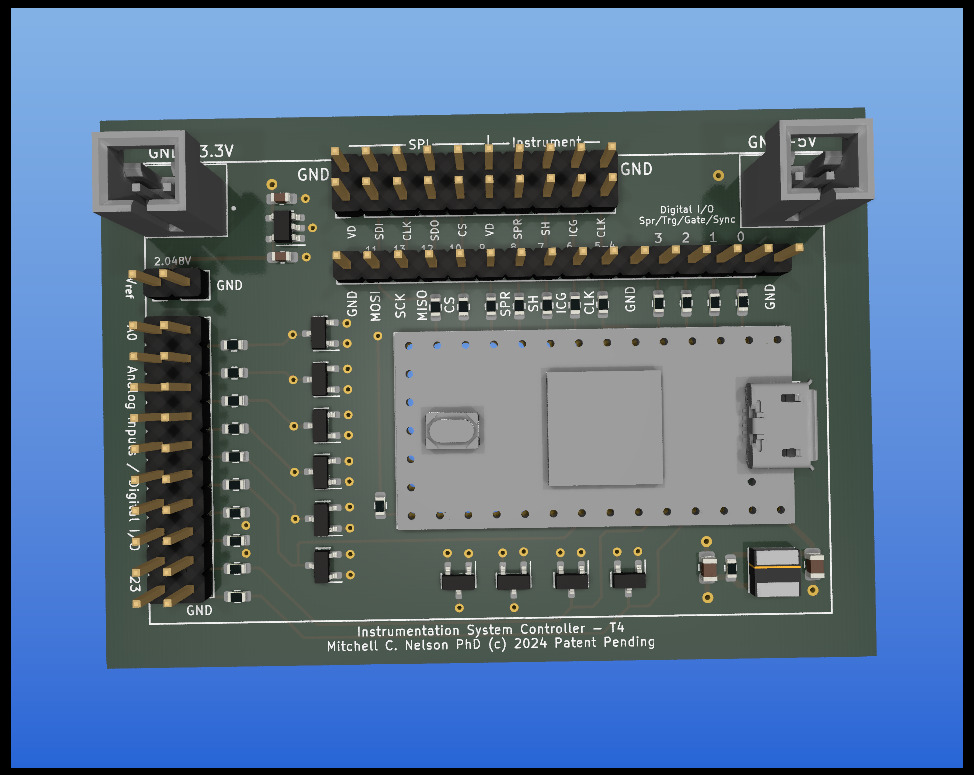
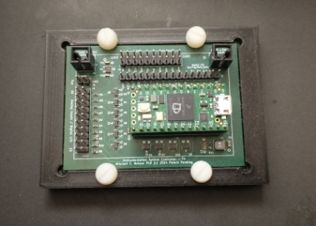
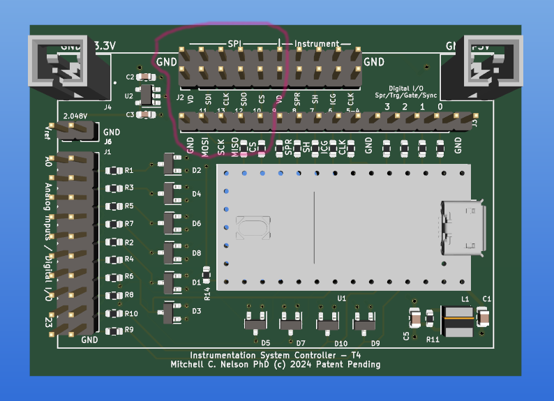
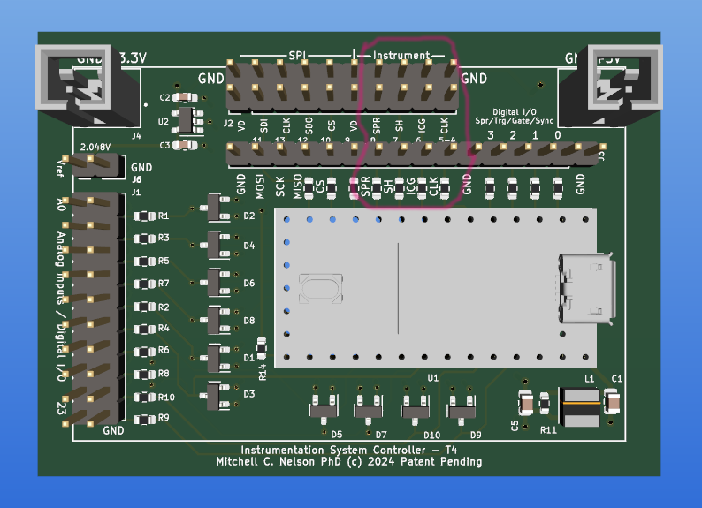
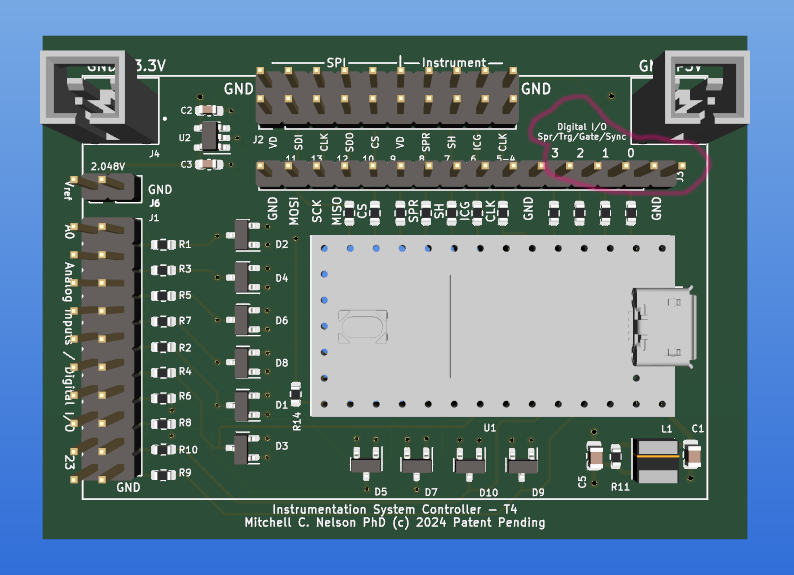
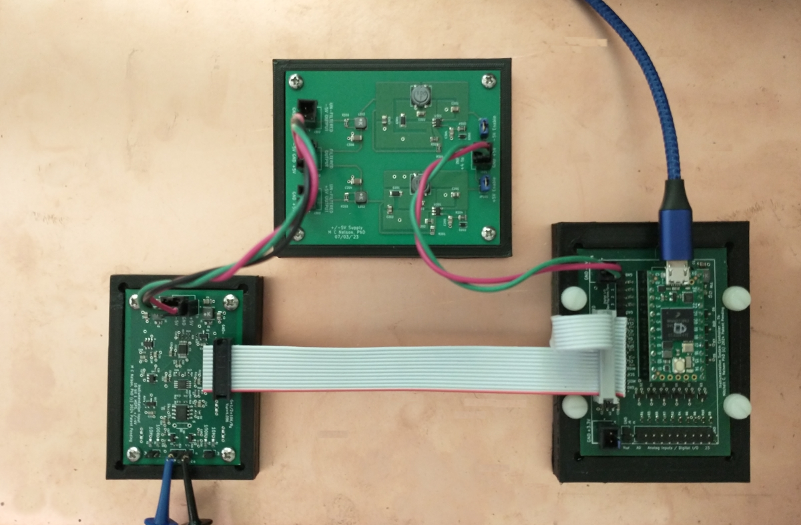

# SPI Instrumentation Controller using Teensy 4.0

Controller board for the SPI Instrumentation project, hosts a Teensy 4.0 and provides connectors for SPI, instrumentation control, 3.3V and 5V power, a precision voltage references, dedicated pins for trigger and gate input, sync and busy output and a set of pins that can be used for analog input or digital i/o.   The connectors are identified in images below.

## Connectors

The following shows the location of the pins for the SPI interface circled in red.

The following shows the location of the pins for interfacing to the Linear CCD SPI boards, circled in red.

The following shows the location of the pins for trigger and gate input and sync and busy output, circled in red.

## Example use
Here is an example of how the board is used, the other two boards in this picture are the InAmp and +5V,-5V power supply.

## Obtaining boards

This repo includes files for FAB and assembly. 

You can [order assembled boards from PCBWAY here](https://www.pcbway.com/project/shareproject/Controller_Teensy_4_0_for_SPI_Instrumentation_boards_4b27edb1.html).

To assemble the board yourself you will need a reflow oven.  You can order bare boards from a sevice such as PCBWay or AllPCB, and use the BOM spreadsheet file to order parts from Digikey

